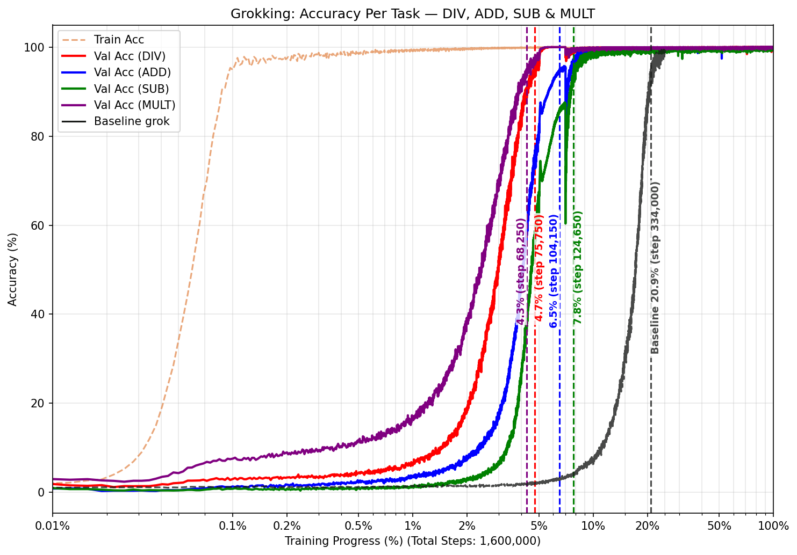

# Understanding Grokking: From Memorization to Generalization

This repository investigates the **grokking** phenomenon — where neural networks suddenly generalize long after perfectly memorizing training data — and tests strategies to accelerate the transition. We train a small decoder-only Transformer on modular arithmetic tasks (division, addition, subtraction, and multiplication) to replicate and extend the results of [Power et al. (2022)](https://arxiv.org/pdf/2201.02177).

Our primary research question: **can task diversity accelerate grokking?** We find that it can — significantly. Training on all four arithmetic operations simultaneously reduces the grokking delay for modular division from 83.5% of training progress down to just 4.7%, an ~18× speedup.

<div align="center">
  
  <p><em>Baseline: Division only. Training accuracy (orange dashed) saturates early while validation accuracy (red) stays near 0% until the abrupt transition at 83.5% training progress (step 334,000).</em></p>
</div>
<div align="center">
  
  <p><em>All four tasks trained simultaneously. Every task groks well before the baseline (black curve), with multiplication leading at 4.3% and division following at 4.7% — an ~18× speedup over the single-task baseline.</em></p>
</div>

---

## Table of Contents

- [Problem Description](#problem-description)
- [Key Findings](#key-findings)
- [Installation](#installation)
- [Dataset](#dataset)
- [Quick Start](#quick-start)
- [Build Targets](#build-targets)
- [Usage](#usage)
- [Command Line Arguments](#command-line-arguments)
- [Expected Outputs](#expected-outputs)
- [Project Structure](#project-structure)
- [Evaluation Metrics](#evaluation-metrics)
- [Experiment Tracking & Logs](#experiment-tracking--logs)
- [Roadmap / TODOs](#roadmap--todos)
- [References](#references)

---

## Problem Description

Grokking is a two-phase learning phenomenon:

1. **Memorization phase**: The model quickly achieves ~100% training accuracy by memorizing input-output pairs, but validation accuracy stays near chance.
2. **Generalization phase**: After thousands of additional steps under weight-decay pressure, validation accuracy suddenly jumps to ~100%.

The delay between these two phases can be extremely long (hundreds of thousands of steps), making grokking expensive to observe and study. This repo investigates whether **task diversity** — training on multiple arithmetic operations at once — can shorten this delay by encouraging the model to learn shared mathematical structure rather than task-specific shortcuts.

---

## Key Findings

| Experiment | Grokking point (DIV) | Speedup vs. baseline |
|---|---|---|
| Baseline (DIV only) | 83.5% (334,000 steps) | — |
| DIV + MULT | 0.7% (5,600 steps) | ~119× |
| All 4 tasks | 4.7% (75,750 steps) | ~18× |
| DIV + ADD | Slower than baseline | — |
| DIV + SUB | Slower than baseline | — |

- **Task diversity accelerates grokking** when tasks share algebraic structure (e.g., division and multiplication both involve multiplicative group operations mod p).
- **Not all task combinations help**: pairing division with addition or subtraction can slow grokking, suggesting that structural compatibility between tasks matters.
- **Weight decay is essential**: without it, models memorize and never generalize.

---

## Installation

> **Requirements**: Python 3.10 or higher.

### Option 1 — Conda (Recommended)

```bash
conda env create -f environment.yml
conda activate grokking
```

### Option 2 — pip

```bash
pip install -r requirements.txt
```

### Dependencies

| Package | Version |
|---|---|
| Python | ≥ 3.10 |
| PyTorch | ≥ 2.0.1 |
| NumPy | ≥ 1.24.3 |
| Matplotlib | ≥ 3.7.1 |
| tqdm | ≥ 4.65.0 |

All dependencies are pinned in `requirements.txt` (pip) and `environment.yml` (conda).

---

## Dataset

No external dataset download is required. All data is **synthetically generated** at runtime by `data.py`.

For a prime modulus `p` (default: `p=97`) and a chosen operation ⊕, the dataset consists of all valid equations of the form:

```
a ⊕ b ≡ c  (mod p)
```

| Task | Formula | Dataset size |
|---|---|---|
| Division (DIV) | x · y⁻¹ mod p (y ≠ 0) | 97 × 96 = 9,312 equations |
| Addition (ADD) | (x + y) mod p | 97 × 97 = 9,409 equations |
| Subtraction (SUB) | (x − y) mod p | 97 × 97 = 9,409 equations |
| Multiplication (MULT) | (x · y) mod p | 97 × 97 = 9,409 equations |

Each dataset is split 50/50 into train and validation sets. In multi-task settings, training data is shuffled across tasks while validation sets remain task-separated for per-task evaluation.

---

## Quick Start

```bash
# Verify the pipeline works (smoke test — completes in seconds)
python run.py test

# Baseline: single-task run on modular division
python run.py

# Multi-task run: all four operations
python run.py --tasks div add sub mult
```

---

## Build Targets

`run.py` supports three targets as the first positional argument:

| Target | Command | Description |
|---|---|---|
| `all` | `python run.py all` | Full pipeline with given flags **(default)** |
| `test` | `python run.py test` | Smoke-test: tiny config (p=11, 200 steps), finishes in seconds |
| `clean` | `python run.py clean` | Delete generated checkpoints and output plots |

### Smoke Test (Unit Test)

Run this first to confirm your environment is correctly set up:

```bash
python run.py test
```

This executes the full pipeline on a minimal configuration (`p=11`, 200 steps, small model) and produces `grokking_test.png`. If this completes without error, your environment is ready.

### Clean Generated Files

```bash
python run.py clean
```

Deletes `checkpoints/` and `grokking_result.png`. Use `--checkpoint_dir` and `--save_path` for non-default paths.

---

## Usage

### Reproduce Baseline

```bash
python run.py --tasks div --lr 1e-3 --weight_decay 1e-3 --num_steps 400000
```

Expected output: `grokking_result.png` showing grokking at ~83.5% training progress (step 334,000).

### Reproduce Task Diversity Experiments

```bash
# Best two-task combination (DIV + MULT)
python run.py --tasks div mult --num_steps 800000

# All four tasks
python run.py --tasks div add sub mult --num_steps 1600000

# All two-task combinations with DIV
python run.py --tasks div add --num_steps 800000
python run.py --tasks div sub --num_steps 800000
python run.py --tasks div mult --num_steps 800000

# All three-task combinations with DIV
python run.py --tasks div add sub --num_steps 1200000
python run.py --tasks div add mult --num_steps 1200000
python run.py --tasks div sub mult --num_steps 1200000
```

> **Note on step scaling**: We train for an additional 400,000 steps per additional task to ensure each task sees the same total number of training examples as the baseline, enabling fair comparison.

### Custom Configuration

```bash
python run.py \
  --tasks div add sub mult \
  --lr 5e-4 \
  --weight_decay 5e-3 \
  --num_steps 200000 \
  --batch_size 256 \
  --d_model 256 \
  --nhead 8
```

### Experiment with Weight Decay

```bash
python run.py --tasks div --lr 5e-4 --weight_decay 1e-1
python run.py --tasks div --lr 5e-4 --weight_decay 1e-2
python run.py --tasks div --lr 5e-4 --weight_decay 1e-3
python run.py --tasks div --lr 5e-4 --weight_decay 0
```

### Resuming Interrupted Training

Re-run the exact same command. The script automatically detects the latest checkpoint and resumes:

```bash
# Interrupted at step 50,000
python run.py --tasks div mult --num_steps 800000

# Resume from step 50,000
python run.py --tasks div mult --num_steps 800000
```

---

## Command Line Arguments

### Target (positional, optional)
- `all` – full pipeline (default)
- `test` – smoke-test with a tiny configuration
- `clean` – remove checkpoints and plots

### Task Configuration
- `--tasks`: Tasks to train on (choices: `div`, `add`, `sub`, `mult`; default: `['div']`)

### Data Parameters
- `--p`: Prime modulus (default: `97`)
- `--train_fraction`: Training data fraction (default: `0.5`)
- `--seed`: Random seed for reproducibility (default: `42`)

### Model Parameters
- `--d_model`: Embedding dimension (default: `128`)
- `--nhead`: Number of attention heads (default: `4`)
- `--num_layers`: Number of transformer layers (default: `2`)
- `--dropout`: Dropout rate (default: `0.0`)

### Optimizer Parameters
- `--lr`: Learning rate (default: `1e-3`)
- `--weight_decay`: Weight decay — crucial for grokking (default: `1e-3`)

### Training Parameters
- `--batch_size`: Batch size (default: `512`)
- `--num_steps`: Total training steps (default: `400000`)

### Output Parameters
- `--checkpoint_dir`: Checkpoint directory (default: `checkpoints`)
- `--save_path`: Output plot path (default: `grokking_result.png`)

---

## Expected Outputs

After a successful run, the following files are produced:

| File | Description |
|---|---|
| `grokking_result.png` | Accuracy curves (train + per-task val) vs. training progress % on a log scale |
| `checkpoints/checkpoint.pt` | Latest training checkpoint (model weights, optimizer state, full history) |
| `grokking_test.png` | Output from `python run.py test` (smoke test only) |

### Reading the Plot

- **Orange dashed line**: Combined training accuracy
- **Colored solid lines**: Per-task validation accuracy (red=DIV, blue=ADD, green=SUB, purple=MULT)
- **Vertical dashed lines**: Mark the step at which each task first exceeded 95% validation accuracy
- **X-axis**: Log-scale training progress (%) — this makes the sudden generalization transition visually prominent regardless of total steps run
- **Black curve** (multi-task plots only): Baseline division-only curve for comparison

---

## Project Structure

```
.
├── README.md                # This file
├── requirements.txt         # Python dependencies with pinned versions (pip)
├── environment.yml          # Conda environment specification
├── run.py                   # Entry point: all / test / clean build targets
├── data.py                  # Dataset generation, vocabulary, tokenization
├── model.py                 # Decoder-only Transformer architecture
├── train.py                 # Training loop, evaluation, checkpointing, grokking detection
├── utils.py                 # Plotting and visualization utilities
├── grokking_plot.png        # Example output plot (baseline: division only)
└── all_four_tasks_plot.png  # Example output plot (all four tasks simultaneously)
```

> **Note**: `checkpoints/` is not included in the repo — it is created automatically the first time you run training and stores `checkpoint.pt` (model weights, optimizer state, and full training history).

**Code organization principles:**
- `data.py`, `model.py`, `train.py`, `utils.py` — library modules containing all implementation logic
- `run.py` — thin build script that imports and calls library code; contains no implementation logic
- All hyperparameters are passed as CLI arguments or via `TEST_CONFIG`; nothing is hard-coded in library modules

---

## Evaluation Metrics

Grokking is detected and tracked automatically during training using the following metrics:

- **Training accuracy**: Fraction of training equations correctly predicted; reaches ~100% early (memorization phase)
- **Validation accuracy** (per task): Fraction of held-out equations correctly predicted; tracked separately for each arithmetic task
- **Grokking step**: The first training step at which a task's validation accuracy exceeds **95%**
- **Training progress %**: Grokking step divided by total steps, used for fair cross-experiment comparison

All metrics are logged every 50 steps and stored inside the checkpoint history dictionary, allowing full post-hoc analysis even after training completes.

---

## Experiment Tracking & Logs

All training history is saved inside the checkpoint file (`checkpoints/checkpoint.pt`) as a Python dictionary with the following structure:

```python
history = {
    'steps':      [...],          # Step numbers where metrics were logged
    'train_loss': [...],          # Training loss at each logged step
    'train_acc':  [...],          # Training accuracy (%) at each logged step
    'val_stats':  {               # Per-task validation metrics
        'div': {'loss': [...], 'acc': [...]},
        'add': {'loss': [...], 'acc': [...]},
        ...
    },
    'grok_steps': {               # Step at which each task first grokked (or None)
        'div': 334000,
        'add': None,
        ...
    },
    'config': {...}               # Full hyperparameter configuration
}
```

To load and inspect a checkpoint manually:

```python
import torch
ckpt = torch.load('checkpoints/checkpoint.pt', map_location='cpu')
history = ckpt['history']
print(history['grok_steps'])
```

---

## Roadmap / TODOs

The following extensions are planned or worth investigating:

- [ ] **Mechanistic interpretability**: Apply attention visualization and probing classifiers to examine whether multi-task models learn qualitatively different internal representations compared to single-task models
- [ ] **Hyperparameter sweeps**: Systematically vary `weight_decay`, `lr`, `train_fraction`, and `batch_size` to characterize their effect on grokking speed in multi-task settings
- [ ] **Model size ablations**: Test whether task diversity acceleration holds for larger models (`d_model=256`, more layers) and smaller primes (`p=23`, `p=47`)
- [ ] **Alternative primes**: Test generalization of findings across different prime moduli beyond `p=97`
- [ ] **Non-arithmetic task diversity**: Investigate whether diversity across structurally dissimilar tasks (e.g., arithmetic + string manipulation) produces similar acceleration effects
- [ ] **Automated experiment sweep script**: Add a script to run all task combinations in sequence and aggregate results into a summary table
- [ ] **Logging integration**: Add optional integration with Weights & Biases (`wandb`) for richer experiment tracking and visualization

---

## References

- [Power et al. (2022). "Grokking: Generalization Beyond Overfitting on Small Algorithmic Datasets." arXiv:2201.02177](https://arxiv.org/pdf/2201.02177)
- [Lyu, Jin, Li, Du, Lee & Hu (2024). "Dichotomy of Early and Late Phase Implicit Biases Can Provably Induce Grokking." ICLR 2024. arXiv:2311.18817](https://arxiv.org/abs/2311.18817)
- [Kim et al. (2025). "Task Diversity Shortens the ICL Plateau." arXiv preprint](https://arxiv.org/abs/2501.14573)