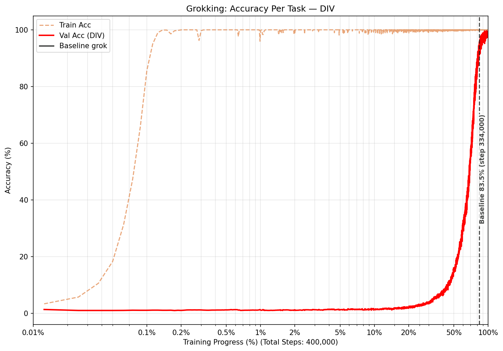

# Understanding Grokking: From Memorization to Generalization

This repository provides an implementation to reproduce and investigate the **grokking** phenomenon, where neural networks suddenly generalize long after overfitting the training set. The code trains a simple transformer on modular arithmetic tasks (division, addition, subtraction, and multiplication), replicating the abrupt generalization transition described in [Power et al. (2022)](https://arxiv.org/pdf/2201.02177). It supports multi-task training, per-task grokking detection, and visualization of the transition from memorization to generalization.

## Overview

The model learns to perform modular arithmetic operations: given `a ⊕ b mod p`, predict the result, where ⊕ can be division, addition, subtraction, or multiplication. With proper regularization (weight decay), the model first memorizes the training set, then after many more optimization steps, suddenly achieves perfect generalization on the validation set.

The implementation supports:
- **Multi-task training**: Train on multiple arithmetic operations simultaneously
- **Per-task validation**: Track generalization performance separately for each task
- **Grokking detection**: Automatically identify when each task reaches 95% validation accuracy
- **Checkpoint system**: Resume training from saved checkpoints
- **Visualization**: Accuracy curves plotted on a log-scale training-progress (%) x-axis



---

## Installation

### Using Conda (Recommended)

```bash
conda env create -f environment.yml
conda activate grokking
```

### Using pip

```bash
pip install -r requirements.txt
```

> **Note**: Python 3.10 or higher is required.

---

## Quick Start

```bash
# Single-task run (division, default settings)
python run.py

# Multi-task run
python run.py --tasks div add sub mult
```

This trains for 400,000 steps (lr=1e-3, weight_decay=1e-3) and saves `grokking_result.png`.

---

## Build Targets

`run.py` supports three targets passed as the first positional argument:

| Target  | Command              | Description                                      |
|---------|----------------------|--------------------------------------------------|
| `all`   | `python run.py all`  | Full pipeline with given flags **(default)**     |
| `test`  | `python run.py test` | Smoke-test: tiny config, finishes in seconds     |
| `clean` | `python run.py clean`| Delete generated checkpoints and output plots    |

### Verify the pipeline runs correctly (smoke test)

```bash
python run.py test
```

This runs the full pipeline on a minimal configuration (p=11, 200 steps, small model) and produces `grokking_test.png`. Use this to confirm your environment is set up correctly before launching a long training run.

### Clean generated files

```bash
python run.py clean
```

Deletes the `checkpoints/` directory and `grokking_result.png`. Pass `--checkpoint_dir` and `--save_path` if you used non-default paths.

---

## Usage

### Single Task Training

```bash
python run.py --tasks div --lr 1e-3 --weight_decay 1e-3
```

### Multi-Task Training

```bash
python run.py --tasks div mult --lr 1e-3 --weight_decay 1e-3
```

### Custom Configuration

```bash
python run.py \
  --tasks div add sub mult \
  --lr 5e-4 \
  --weight_decay 5e-3 \
  --num_steps 200000 \
  --batch_size 256 \
  --d_model 256 \
  --nhead 8
```

### Resuming Interrupted Training

Simply re-run the same command. The script will automatically detect the latest checkpoint and resume from the saved step:

```bash
# Initial run (interrupted at step 50,000)
python run.py --tasks div mult --num_steps 100000

# Resume (continues from step 50,000)
python run.py --tasks div mult --num_steps 100000
```

---

## Command Line Arguments

### Target (positional, optional)
- `all` – full pipeline (default)
- `test` – smoke-test with a tiny configuration
- `clean` – remove checkpoints and plots

### Task Configuration
- `--tasks`: Tasks to train on (choices: `div`, `add`, `sub`, `mult`; default: `['div']`)

### Data Parameters
- `--p`: Prime modulus (default: `97`)
- `--train_fraction`: Training data fraction (default: `0.5`)
- `--seed`: Random seed (default: `42`)

### Model Parameters
- `--d_model`: Embedding dimension (default: `128`)
- `--nhead`: Number of attention heads (default: `4`)
- `--num_layers`: Number of transformer layers (default: `2`)
- `--dropout`: Dropout rate (default: `0.0`)

### Optimizer Parameters
- `--lr`: Learning rate (default: `1e-3`)
- `--weight_decay`: Weight decay — crucial for grokking (default: `1e-3`)

### Training Parameters
- `--batch_size`: Batch size (default: `512`)
- `--num_steps`: Total training steps (default: `400000`)

### Output Parameters
- `--checkpoint_dir`: Checkpoint directory (default: `checkpoints`)
- `--save_path`: Output plot path (default: `grokking_result.png`)

---

## Examples

### Compare Grokking Across Tasks

```bash
python run.py --tasks div add sub mult --num_steps 150000
python run.py --tasks div mult --num_steps 100000
```

### Experiment with Weight Decay

```bash
python run.py --tasks div add --lr 5e-4 --weight_decay 1e-1
python run.py --tasks div add --lr 5e-4 --weight_decay 1e-2
python run.py --tasks div add --lr 5e-4 --weight_decay 1e-3
python run.py --tasks div add --lr 5e-4 --weight_decay 0
```

### Larger Model

```bash
python run.py --tasks div add sub mult --d_model 256 --nhead 8 --num_layers 4
```

---

## Project Structure

```
.
├── README.md           # This file
├── requirements.txt    # Python dependencies (pip)
├── environment.yml     # Conda environment specification
├── run.py              # Build script: all / test / clean targets
├── data.py             # Data generation and preprocessing
├── model.py            # Transformer model definition
├── train.py            # Training loop, checkpointing, grokking detection
└── utils.py            # Plotting utilities
```

**Code organisation:**
- `data.py`, `model.py`, `train.py`, `utils.py` — library code containing all implementation logic
- `run.py` — build script that imports and calls library code; contains no implementation logic
- All hyper-parameters are passed as CLI arguments (or set via `TEST_CONFIG` for the `test` target) — nothing is hard-coded in library code

---

## Output: Visualization

The generated plot shows accuracy curves against **training progress (%)** on a log scale. This x-axis normalisation makes the sudden generalisation transition visually prominent regardless of how many total steps were run.

- **Orange dashed line**: Combined training accuracy
- **Colored solid lines**: Per-task validation accuracy (red=div, blue=add, green=sub, purple=mult)
- **Vertical dashed lines**: Mark the step at which each task first exceeded 95% validation accuracy

---

## Key Findings

- **Weight decay is crucial**: Higher weight decay (e.g., `1e-3`) promotes grokking
- **Training time**: Grokking typically occurs after 10,000–300,000 steps, well after memorization
- **Task-dependent grokking**: Different arithmetic operations grok at different times
- **Multi-task interference**: Training on multiple tasks simultaneously can affect grokking dynamics

---

## References

- [Power et al. (2022). "Grokking: Generalization Beyond Overfitting on Small Algorithmic Datasets"](https://arxiv.org/pdf/2201.02177)